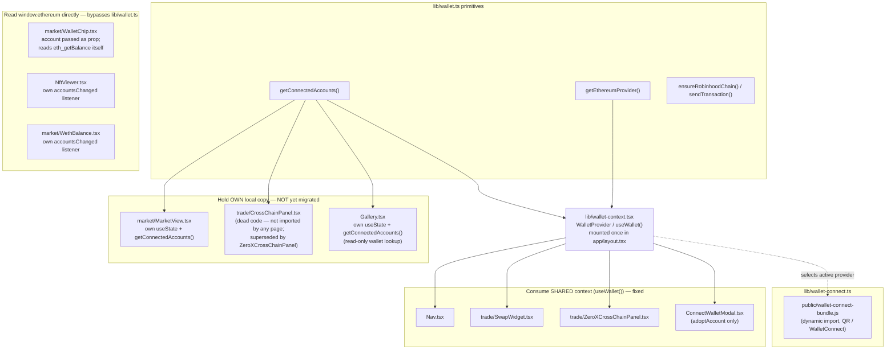
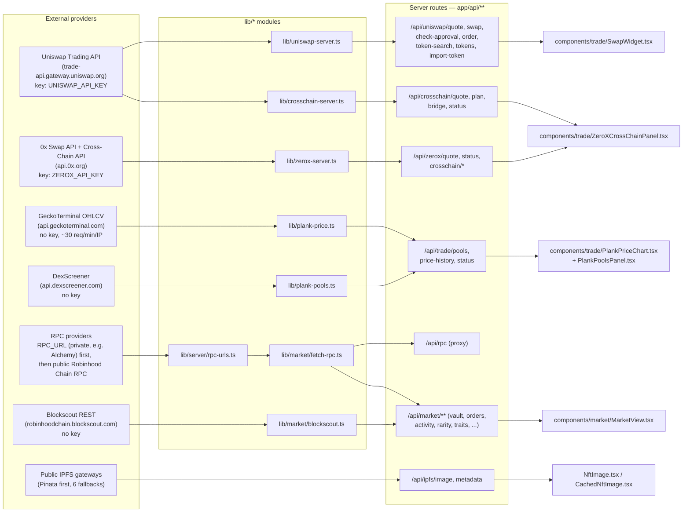
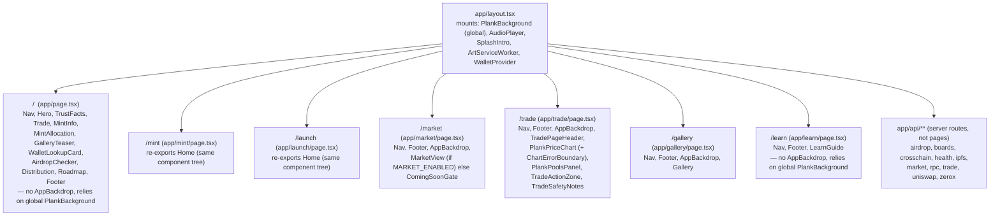

# Architecture Map

A visual, verified-against-source inventory of plank.love's runtime
components: wallet/connection state, trading data flow, routes, and feature
flags. This exists because tracing "what talks to what" by memory has already
produced real bugs — see [Known liabilities](#known-liabilities) and the
incidents referenced there.

**How to keep this current**: when you add a component that reads wallet
state, add/remove an `app/api/**` route, add a `NEXT_PUBLIC_*` flag, or change
which external provider a feature calls, update the relevant diagram/table in
this file in the same PR. Each diagram is scoped narrowly on purpose — prefer
adding a new small diagram over growing an existing one past readability.
Every node below was confirmed against source on 2026-07-30; if you can't
verify something, mark it "unverified" rather than guessing.

## Contents

1. [Wallet / connection state](#1-wallet--connection-state)
2. [Trading data flow](#2-trading-data-flow)
3. [Page / route map](#3-page--route-map)
4. [Feature flags](#4-feature-flags)
5. [External dependency inventory](#5-external-dependency-inventory)
6. [Known liabilities](#6-known-liabilities)

---

## 1. Wallet / connection state

This is the highest-value diagram in this document. The site shipped a real
bug where the nav showed "Connect wallet" while a trade panel simultaneously
showed a connected address, because every consumer called
`getConnectedAccounts()` from `lib/wallet.ts` and kept its **own** `useState`,
and only one of them subscribed to `accountsChanged`/`chainChanged`.
`lib/wallet-context.tsx` (`WalletProvider` / `useWallet()`) was introduced as
the single shared source of truth and is mounted once in `app/layout.tsx`.

**As of 2026-07-30, both patterns still coexist in the tree** — this is the
fact this diagram exists to make impossible to miss:

| Component | Pattern | Notes |
| --- | --- | --- |
| `Nav.tsx` | shared (`useWallet`) | `address`, `isConnected`, `disconnect` |
| `components/trade/SwapWidget.tsx` | shared (`useWallet`) | `address`, `chainId`, `connect`, `adoptAccount` |
| `components/trade/ZeroXCrossChainPanel.tsx` | shared (`useWallet`) | `address`, `connect` |
| `components/ConnectWalletModal.tsx` | shared (`useWallet`) | uses `adoptAccount` to hand off a WalletConnect session |
| `components/market/MarketView.tsx` | **local** `useState` | own `getConnectedAccounts()` call, no shared context — the same class of bug the context was built to fix |
| `components/Gallery.tsx` | **local** `useState` | own `getConnectedAccounts()` call (read-only wallet lookup for owned NFTs) |
| `components/trade/CrossChainPanel.tsx` | **local** `useState` | confirmed **dead code**: not imported by `TradeModeSwitch.tsx` or any page — `ZeroXCrossChainPanel` replaced it in the mounted UI |
| `components/market/WalletChip.tsx` | prop-only + raw `window.ethereum` | receives `account` as a prop, but reads `eth_getBalance` directly instead of through `lib/wallet.ts` |
| `components/NftViewer.tsx` | raw `window.ethereum.on("accountsChanged", ...)` | own listener, bypasses both `lib/wallet.ts` and the context |
| `components/market/WethBalance.tsx` | raw provider `on("accountsChanged", ...)` | own listener for balance refresh only |

**Unverified / not checked**: `components/trade/TokenSelectModal.tsx` was
grepped and does not itself call `getConnectedAccounts()` or `useWallet()` —
it receives wallet-derived data as props from its caller.

---

## 2. Trading data flow

**Server-only vs. client-reachable**

| Provider | Called from | Client can reach it? | API key required |
| --- | --- | --- | --- |
| Uniswap Trading API | `lib/uniswap-server.ts` (server only) | No — only via same-origin `/api/uniswap/*` | Yes — `UNISWAP_API_KEY`, never bundled |
| 0x Swap + Cross-Chain API | `lib/zerox-server.ts` (server only) | No — only via same-origin `/api/zerox/*` | Yes — `ZEROX_API_KEY`, never bundled |
| GeckoTerminal OHLCV | `lib/plank-price.ts` (server only) | No — via `/api/trade/price-history` | No (free tier) |
| DexScreener | `lib/plank-pools.ts` (server only) | No — via `/api/trade/pools` | No |
| Blockscout REST | `lib/market/blockscout.ts` (server only) | No — via `/api/market/*` | No |
| RPC (private + public) | `lib/server/rpc-urls.ts`, vault `fetch-rpc`, order-signature verifier | No — only via same-origin `/api/rpc` proxy | Optional — `RPC_URL` (private, e.g. Alchemy); falls back to public Robinhood Chain RPC if unset |
| Public IPFS gateways | `lib/ipfs.ts` (server only) | No — only via `/api/ipfs/image` and `/api/ipfs/metadata` proxies (avoids browser ORB blocking) | No |
| WalletConnect / Reown relay | `lib/wallet-connect.ts` via `public/wallet-connect-bundle.js` | Yes — this one runs client-side by design (QR pairing) | Yes — `NEXT_PUBLIC_WALLETCONNECT_PROJECT_ID` |

**$PLANK price chart pool note** (verified in `lib/plank-price.ts`): the
chart intentionally tracks a single pool — the Uniswap v2 PLANK/WETH pool at
`0x01b1BEf6fBA02c846eA5c4Ff59193988B5f86F73` (~$71K liquidity), the deepest
of five real pools DexScreener lists (`lib/plank-pools.ts`) — and the module
comment explicitly requires the UI to say which pool it represents rather
than imply a single canonical "$PLANK price." `components/trade/TradeStatusPanel.tsx`
does **not** yet reflect which routing provider (Uniswap vs. 0x) is active
when the user is on the 0x cross-chain tab — see
[Known liabilities](#known-liabilities) and `docs/TRADE_PAGE_SPEC.md`, which
already documents this exact bug with file/line references.

---

## 3. Page / route map

`/` (home), `/mint`, and `/launch` all render the exact same `Home` component
tree (`app/mint/page.tsx` and `app/launch/page.tsx` re-export `../page`) —
they differ only in metadata, not content. `/market`, `/trade`, and `/gallery`
additionally mount `components/AppBackdrop.tsx` on top of the layout-global
`PlankBackground`; `/` and `/learn` do not.

---

## 4. Feature flags

All `NEXT_PUBLIC_*` values are embedded in the browser bundle at build time
and must be treated as public. Defaults below are the code's fallback when
the variable is unset, verified against `lib/constants.ts`,
`lib/crosschain-constants.ts`, and `lib/zerox-server.ts`.

| Flag | Gates | Default when unset | Source |
| --- | --- | --- | --- |
| `NEXT_PUBLIC_MARKET_ENABLED` | Whether `/market` renders `MarketView` or `ComingSoonGate` (no order-relay API, listing contract, or vault contract exists until every SPEC.md §7 gate is satisfied) | `false` (off) | `lib/constants.ts:184` |
| `NEXT_PUBLIC_TRADE_PAUSED` | Hard pause on the on-site Uniswap widget (countdown shows STAND BY) | `false` (open) | `lib/constants.ts:71` |
| `NEXT_PUBLIC_TRADE_OPENS_AT` | ISO 8601 time the widget unlocks | `2026-07-25T21:20:00.000Z` | `lib/constants.ts:62` |
| `NEXT_PUBLIC_RULES_RELAXED` | Whether off-site venue deep-links (Uniswap.app etc.) are treated as safe post-launch | `false` (site widget is the only sanctioned venue) | `lib/constants.ts:84` |
| `NEXT_PUBLIC_GASLESS_ENABLED` | UniswapX gasless swap toggle, both server (`/api/uniswap/quote` protocol list, `/api/uniswap/order` acceptance) and client (whether the toggle renders) | `false` (off) | `lib/constants.ts:100` |
| `NEXT_PUBLIC_CROSSCHAIN_ENABLED` | Uniswap-routed "Buy from another chain" panel (CHAINED/BRIDGE routing via Across) | `false` (off) | `lib/crosschain-constants.ts:18` |
| `NEXT_PUBLIC_ZEROX_ENABLED` | 0x same-chain price-comparison quoting | `false` (off) | `lib/zerox-server.ts:29` |
| `NEXT_PUBLIC_ZEROX_CROSSCHAIN_ENABLED` | 0x true one-step cross-chain buy into $PLANK | `false` (off) | `lib/zerox-server.ts:32` |
| `NEXT_PUBLIC_MARKET_VAULT_ADDRESS` | Primary V2 Marketplank vault address | `null` (vault sends disabled) | `lib/constants.ts:228` |
| `NEXT_PUBLIC_MARKET_VAULT_LEGACY_ADDRESS` | Legacy V1 vault, dual-vault mode | `null` (single/no vault) | `lib/constants.ts:238` |
| `NEXT_PUBLIC_ROBINHOOD_RPC_URL` | Browser RPC for chain reads that don't go through `/api/rpc` (e.g. mint contract) | falls back to public Robinhood Chain RPC | `lib/mint-contract.ts:9` |
| `NEXT_PUBLIC_WALLETCONNECT_PROJECT_ID` | Reown/WalletConnect project ID for QR pairing | empty (WalletConnect QR path unusable until set, user can paste one client-side as a fallback) | `lib/wallet-connect.ts:65` |
| `NEXT_PUBLIC_SITE_URL` | Canonical origin used in metadata/OG tags | `https://plank.love`-shaped fallback in `lib/public-json.ts` | `lib/public-json.ts:51` |
| `NEXT_PUBLIC_MINT_START_AT` | Optional mint countdown target | unset = no countdown | read directly (not via `lib/constants.ts`) |

**Server-only flags/secrets** (not `NEXT_PUBLIC_`, never bundled):

| Variable | Gates |
| --- | --- |
| `DURABLE_KV_BACKEND=postgres` | Selects PostgreSQL as the durable store in production; unset falls back to local-only file/memory (`lib/market/durable-kv.ts`) |
| `UNISWAP_API_KEY` | Whether `/api/uniswap/*` can call the Trading API at all (`isTradingApiConfigured()`) |
| `ZEROX_API_KEY` | Whether `/api/zerox/*` can call 0x at all |
| `RPC_URL` | Private RPC (e.g. Alchemy) tried first for every server-side chain read; unset falls back to the rate-limited public Robinhood Chain RPC |
| `CRON_SECRET` | Authorizes the legacy HTTP settlement endpoint, if retained |
| `RELAYER_PRIVATE_KEY` | Drand relayer gas wallet — cron-only, must never load in Passenger |

---

## 5. External dependency inventory

| Dependency | Used for | Credential required | Env var | Free-tier limit | On failure |
| --- | --- | --- | --- | --- | --- |
| Uniswap Trading API | Same-chain quotes/swaps, gasless (UniswapX), CHAINED cross-chain buys | Yes | `UNISWAP_API_KEY` | Not documented in-repo | `/api/uniswap/*` returns an error; `TradeStatusPanel` shows "Offline — use Uniswap" via `tradingApiConfigured` |
| 0x Swap API + Cross-Chain API | Second same-chain quote for price comparison; true one-step cross-chain buys | Yes | `ZEROX_API_KEY` | Not documented in-repo | `/api/zerox/*` errors surface to `ZeroXCrossChainPanel`; feature is flag-gated off by default |
| GeckoTerminal | $PLANK/WETH OHLCV candles for the price chart (single deepest pool) | No | — | ~30 req/min/IP (documented in `lib/plank-price.ts`) | Falls back to last known-good cached snapshot marked `stale: true`; throws only if no cache exists |
| DexScreener | All-pool token-level stats (5 pools) for the pools panel | No | — | Not documented in-repo | Same cache-then-last-good fallback pattern as GeckoTerminal |
| Blockscout REST | NFT ownership/transfer reads, chain data when RPC rate-limits | No | — | Not documented in-repo | Falls back to RPC path where applicable |
| RPC (private, e.g. Alchemy) + public Robinhood Chain RPC | All server-side chain reads (`/api/rpc`, vault `fetch-rpc`, order-signature verifier) | Optional (private) | `RPC_URL` | Public fallback documented as "rate-limited and not recommended for production" (source of past intermittent 502/429s) | Verifier walks every provider in the ordered list on retry rather than hammering one URL |
| Public IPFS gateways (Pinata primary, 6 fallbacks) | NFT metadata/image resolution | No | — | Not documented in-repo | Tries each gateway in order; proxied through `/api/ipfs/*` to avoid browser ORB blocking |
| WalletConnect / Reown relay | QR-based mobile wallet pairing | Yes (project ID, not secret) | `NEXT_PUBLIC_WALLETCONNECT_PROJECT_ID` | Not documented in-repo | Falls back to browser-extension connect path only |

---

## 6. Known liabilities

Factual, verified against source on 2026-07-30.

- **`public/wallet-connect-bundle.js` is 4,862,013 bytes (~4.86 MB) with no
  build script anywhere in this repository.** `lib/wallet-connect.ts` dynamic-
  imports it at runtime and `next.config.ts` sets a cache header for it, but
  nothing in `package.json`, `scripts/`, or the Dockerfile regenerates it. It
  is effectively an unpatchable, unregenerable checked-in binary artifact.
- **Wallet connection state is only partially unified.** `lib/wallet-context.tsx`
  (`WalletProvider`/`useWallet()`) is the intended single source of truth and
  is used by `Nav.tsx`, `SwapWidget.tsx`, `ZeroXCrossChainPanel.tsx`, and
  `ConnectWalletModal.tsx` — but `components/market/MarketView.tsx` and
  `components/Gallery.tsx` still hold their own local `useState` populated by
  a direct `getConnectedAccounts()` call, the same bug class the shared
  context was built to eliminate. `components/trade/CrossChainPanel.tsx` has
  the same local-state pattern but is dead code (not mounted anywhere).
  `NftViewer.tsx` and `market/WethBalance.tsx` also register their own raw
  `accountsChanged` listeners outside both `lib/wallet.ts` and the context.
- **`TradeStatusPanel.tsx` hardcodes "Uniswap Trading API" and a `0.4207%`
  fee** regardless of whether the user is on the same-chain or 0x
  cross-chain tab (`TradeModeSwitch`'s tab state is not read). This is
  already documented with exact line numbers in `docs/TRADE_PAGE_SPEC.md`
  (§ "Fix `TradeStatusPanel`'s Routing row", referencing
  `components/trade/TradeStatusPanel.tsx:106-111`).
- **Page background color drift**: `body`'s literal background
  (`#14100B` in `app/globals.css`) does not match the `wood-950` token
  (`#1B120A`, also in `app/globals.css` / `DESIGN.md`). This is already
  documented in `DESIGN.md` ("Known inconsistencies") as an intentional,
  not-yet-decided item — not a silent bug, but still live.
- **Success/info/danger colors are ad-hoc Tailwind utility classes, not
  design tokens.** Colors like `bg-emerald-400/500`, `text-red-400`,
  `bg-amber-500` appear directly in component markup across at least 30
  files (58 occurrences), rather than through a semantic token the way
  `bg-panel-strong` / `wood-*` are used for surfaces. There is no single
  place to change what "success green" means site-wide.
- **`components/trade/CrossChainPanel.tsx` is dead code.** It defines a full
  Uniswap-only cross-chain panel with its own wallet state, but
  `TradeModeSwitch.tsx` only imports and renders `ZeroXCrossChainPanel`. It
  is reachable by no route.
